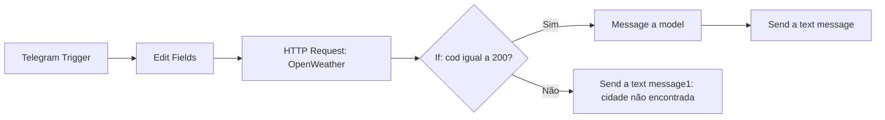

# Bot de clima no Telegram com n8n

Projeto acadêmico de automação que recebe o nome de uma cidade pelo Telegram, consulta os dados meteorológicos atuais no OpenWeather e utiliza um modelo de IA para gerar uma resposta em português com orientações práticas para o dia a dia.

O objetivo é demonstrar a integração entre mensageria, API HTTP, tratamento de dados, decisão condicional e geração de texto em um workflow visual do n8n.

## Funcionamento



| Etapa | Responsabilidade |
| --- | --- |
| `Telegram Trigger` | Recebe uma mensagem enviada ao bot. |
| `Edit Fields` | Salva o texto no campo `queue`, remove espaços nas extremidades e acentos, converte para minúsculas e remove espaços ao redor de vírgulas. Também salva o `chatId`. |
| `HTTP Request` | Faz uma requisição GET a `https://api.openweathermap.org/data/2.5/weather`, com a cidade em `q`, unidades métricas (`metric`) e idioma `pt_br`. |
| `If` | Verifica se o campo `cod` retornado é o número `200`. |
| `Message a model` | Interpreta os dados e pede uma resposta de até oito linhas, com resumo do clima, temperatura, sensação térmica e sugestões de roupas e acessórios. |
| `Send a text message` | Envia o texto gerado ao chat que iniciou a consulta. |
| `Send a text message1` | No ramo falso, envia: “Desculpa! a cidade não foi encontrada!”. |

O prompt fornece cidade, temperatura, sensação térmica, mínimas e máximas retornadas, umidade, pressão, condição do céu, visibilidade, vento e nebulosidade. Ele orienta o modelo a usar apenas os dados recebidos, sem inventar previsão futura.

## Arquivos do projeto

- [`tempo-workflow.json`](tempo-workflow.json): workflow para importar no n8n.
- [`docker-compose.yml`](docker-compose.yml): serviço n8n com porta local `5678`, fuso `America/Bahia` e volume persistente `n8n_data`.
- [`.gitignore`](.gitignore): evita o versionamento de arquivos locais de ambiente.

## Como executar

### 1. Pré-requisitos

- Docker com Docker Compose.
- Um bot do Telegram criado pelo BotFather e seu token de acesso.
- Uma chave de API do OpenWeather com acesso ao endpoint de clima atual.
- Uma credencial de API compatível com o nó de IA e acesso ao modelo escolhido.
- Uma URL pública HTTPS que encaminhe as requisições ao n8n local para receber o webhook do Telegram.

### 2. Configurar o endereço público e iniciar o n8n

O Compose contém um endereço de túnel de desenvolvimento. Antes de executar, substitua-o pelo seu endereço público, ajustando:

```yaml
N8N_HOST: seu-dominio-publico
N8N_PROTOCOL: https
N8N_EDITOR_BASE_URL: https://seu-dominio-publico/
WEBHOOK_URL: https://seu-dominio-publico/
```

Use apenas o nome do host em `N8N_HOST`. Encaminhe seu túnel HTTPS para `http://localhost:5678`. Se o endereço do túnel mudar, atualize a configuração e recrie o serviço.

```bash
docker compose up -d
```

Acesse `http://localhost:5678` e conclua a configuração inicial do n8n. Os dados ficam no volume `n8n_data`. O Compose usa a imagem `n8nio/n8n:latest`; a versão instalada pode variar entre execuções. A opção `N8N_SECURE_COOKIE: "false"` atende ao teste HTTP local e deve ser revisada antes de uma implantação pública.

### 3. Importar e configurar o workflow

1. No editor do n8n, importe o arquivo `tempo-workflow.json`.
2. Cadastre sua credencial do Telegram e selecione-a no `Telegram Trigger` e nos dois nós de envio de mensagem.
3. No `HTTP Request`, substitua o placeholder `<SUA_APPID>` do parâmetro `appid` pela sua chave do OpenWeather. Use o modo de valor fixo, sem o sinal `=` que aparece no valor exportado.
4. Configure a credencial no nó `Message a model` e selecione um modelo disponível na sua conta. O JSON exportado contém o identificador `gpt-5.6-sol`; a importação não garante acesso a esse modelo.
5. Salve as alterações.

As referências de credenciais presentes no JSON pertencem à instância de origem e precisam ser reassociadas. O arquivo `.env` não é carregado pelo workflow para preencher `appid`; a chave deve ser configurada no nó HTTP. Não compartilhe um novo export contendo chaves ou tokens.

### 4. Testar e ativar

Inicie a execução de teste no editor e envie ao bot uma mensagem de texto com o nome da cidade, por exemplo:

```text
Salvador,BR
```

Acompanhe os dados de entrada e saída dos nós e confira a resposta no Telegram. Após o teste, ative ou publique o workflow conforme a interface da sua versão do n8n. O arquivo exportado está com `active: false`.

Para consultar os logs ou interromper o serviço:

```bash
docker compose logs --tail=100 n8n
docker compose down
```

## Exemplo de mensagem recebida

Trecho fornecido como exemplo da resposta enviada ao Telegram, com as sequências `\n` convertidas em quebras de linha para facilitar a leitura:

```text
umidade está alta, em 82%, e o céu está totalmente encoberto.
O vento é fraco, então o clima parece ameno, agradável e um pouco úmido.
🧥 Uma roupa leve com casaco fino é uma boa opção.
💧 Vale levar uma garrafa de água.
🌂 Não há indicação de chuva, mas um guarda-chuva compacto pode ser útil por precaução.

This message was sent automatically with n8n
```

A resposta varia conforme os dados meteorológicos e o texto gerado pelo modelo. O trecho acima é uma evidência ilustrativa fornecida para a documentação, não o resultado de um teste automatizado deste repositório.

## Roteiro de avaliação

| Cenário | O que verificar |
| --- | --- |
| Enviar `Salvador,BR` | Consulta com unidades métricas e resposta em português no mesmo chat. |
| Enviar `  SÃO PAULO , BR  ` | Campo `queue` normalizado para `sao paulo,br`. |
| Consultar uma cidade válida | Passagem pelo ramo verdadeiro e resposta coerente com os dados retornados. |
| Enviar uma cidade inexistente | Inspecionar o erro HTTP, a avaliação do `If` e se a mensagem de cidade não encontrada é enviada. |
| Conferir o texto final | Presença de recomendações práticas e ausência de previsão futura inventada. |

Esse roteiro requer credenciais válidas e execução no n8n. Não há suíte de testes automatizados incluída no projeto.

## Limitações e melhorias possíveis

- O endpoint consultado fornece o clima atual; não há consulta de previsão futura.
- A normalização pressupõe `message.text`. Fotos, áudios e outras mensagens sem texto não têm tratamento específico.
- O nó HTTP está configurado para continuar pela saída regular em caso de erro. Nem todo erro terá um campo `cod` numérico compatível com a validação estrita do `If`; por isso, o ramo de cidade não encontrada precisa ser verificado na instância utilizada.
- A mensagem de erro não diferencia cidade inexistente, falha de autenticação, indisponibilidade e limite de requisições.
- Falhas do modelo de IA e do envio ao Telegram não possuem ramos de recuperação próprios.
- A saída enviada ao Telegram depende da estrutura `output[0].content[0].text` retornada pelo nó de IA.
- Como evolução, podem ser adicionados validação de entrada, respostas específicas para cada erro e uma versão fixa da imagem do n8n para facilitar a reprodução da avaliação.
